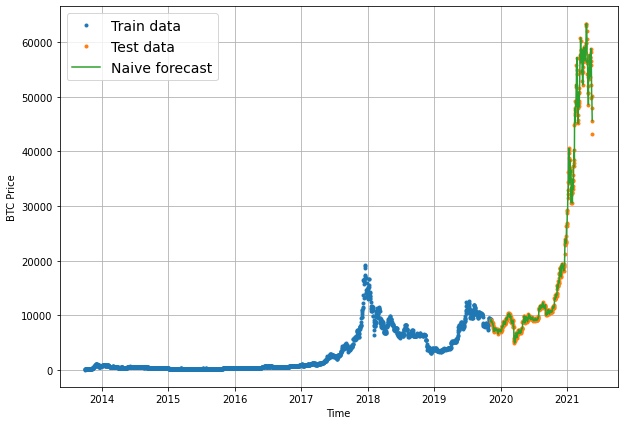
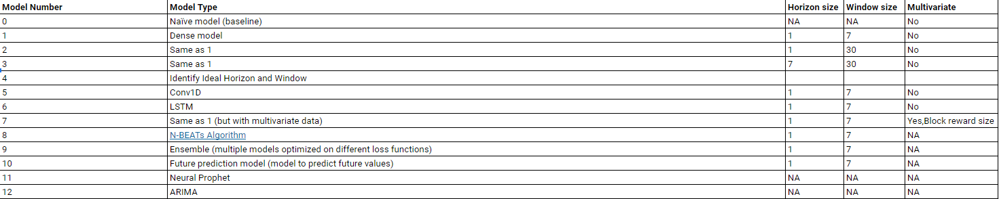

# Bit Predict !!

## Building a series of models in an attempt to predict the price of Bitcoin

This project is an extension of the project in the Zero to Mastery TensorFlow for Deep Learning course taken by Daniel Bourke

## Modelling Experiments

## How to Reproduce

The 01_bit_price_predict_consolidated.ipynb notebook in the notebooks folder has all the steps to reproduce the models.

A cleaned folder scripts will be created where the 01_bit_price_predict_consolidated.ipynb notebook will be broken down to make the code more modular.

